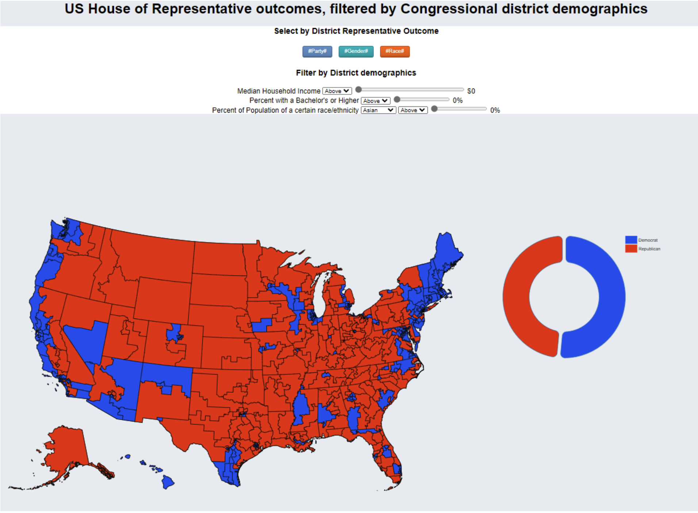
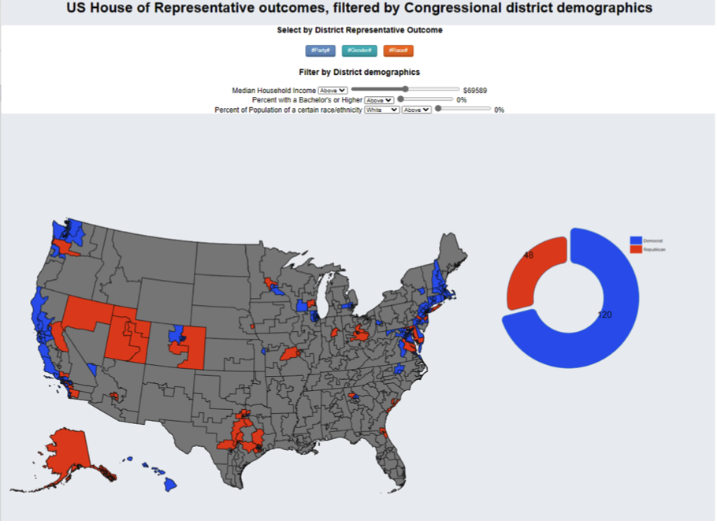
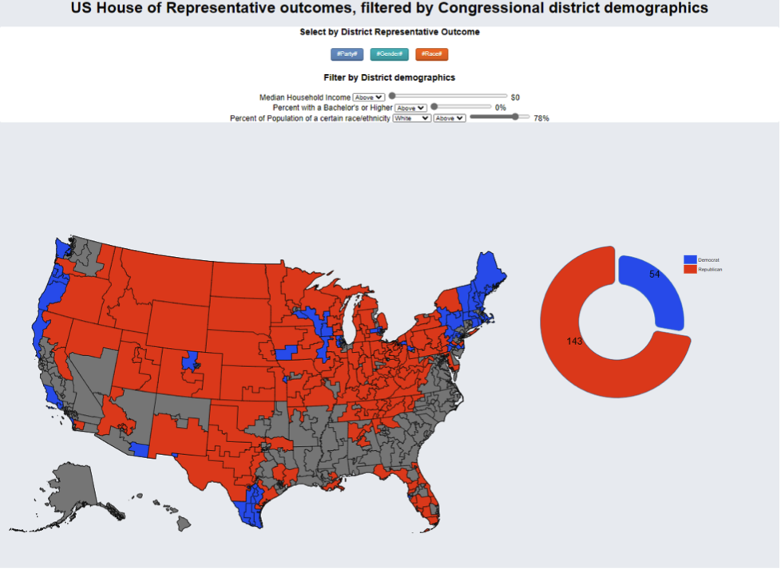

# INFO_Project2
## Overview
Our visualization aims to examine the demographics of the winning candidate, as well as the overall population, of the electoral districts in the 117th Congress. The center of our visualization exhibits a complete map of all U.S. election districts. To the right of the map, you would also see a pie chart with the corresponding information. Without using any of the interactive elements, the map displays the party affiliation of each district. Then, you can select “Gender” or “Race” under the “District Representative” part, in which the map and pie chart will change accordingly to represent the selected feature of the winning candidate of the district representative. You can also play with the filters of district demographics: “Median Household Income”, “Percent with a Bachelor’s Degree or Higher”, “Percent of Population of a certain race/ethnicity.” These are features of the total population of a district. If a district has been filtered out it will turn grey.

## Data Description & Preprocessing
We use data from two sources. The first one is from GitHub, which contains information of the 117th Congress - United States House members - demographic data. We use this dataset to show the winning candidate features of each election district.

The second source we use is from the United States Census Bureau. This one contains comprehensive data of each election district, including population, housing, socio-economic status, etc. We use this dataset to show the overall information about the district. 

After we downloaded the district demographics file from the Census Bureau, we renamed the file and file columns of states with only one district in order to prepare them to be loaded into JavaScript using an array. Because North Carolina data was bugged on the website, we entered the data manually from another source, datausa.io, which had scraped the data from the Census website before it broke. Then we wrote code that would read the data from 50 state district demographics csv files and put them all into one array. We also imported the geojson data to topojson in order to make the map. Then, we use geoAlbersUsa projection to draw the map and corresponding electoral districts. 

## Design Rationale
The map has
- Marks: the U.S. electoral district map
- Channels: Different colors to fill the districts with different features - grey if no feature

The pie chart has
- Marks: Circle
- Channels: Different colors to represent the total number of districts with that feature

Both the map and pie chart have consistent labels and colors to reflect the same information. We also intentionally chose different color scales to distinguish different sets of features. For “Party”, we chose blue for democrat and red for republican, which are the commonly known party colors for the two. For “Gender”, we chose light blue and pink to represent male and female, which also reflects social norms. For “Race”, we picked another color set with a range of colors for different races. In this way, the users have a clear idea of which features are selected and how they play out differently.

## Interactive Elements
We have implemented two sets of features for interaction. The first set - “Select by District Representative Outcome” - corresponds to features of the winning candidate, displayed on the top of the page, for users to select. In addition to the partisan affiliation of the winning candidate of each district, users can also select buttons of gender or race. Upon selection, we see colors of the map change to reflect the feature we select.

The second set - “Filter by District Demographics” - corresponds to the overall population of the district. Users can use the filter to select the intended range of household income, percent with bachelor’s degree, and percent of each race. This function gives the users independence to see the data distribution of interest.
In addition, we have also implemented mouseover functions. Users can see the name of the state and district number when mouse over a certain area on the map. For the pie chart when users mouse over it, they would see the exact number of districts with that certain feature.

## The Story
Congress is the legislative branch of the federal government and plays an important role in making the decisions that affect our everyday lives. Therefore, it’s important to understand the composition of the Congress with respect to the electoral districts in order to see who has a say. From the visualization, we see that most of the winning candidates are white males (73%), which is expected due to the history of the country. Since the Declaration of Independence in 1776, the political power has always been in the hands of the majority white males. However, over the 200 hundred years, diverse groups have come to the U.S. and found homes here. Has everyone’s voice been heard?

We can also easily visualize the population of people who tend to vote for democrats vs. republicans. Here are some interesting findings:
1. Districts of predominantly white are tend to be more Republican.

2. Districts of higher median income tend to be more Democratic.

